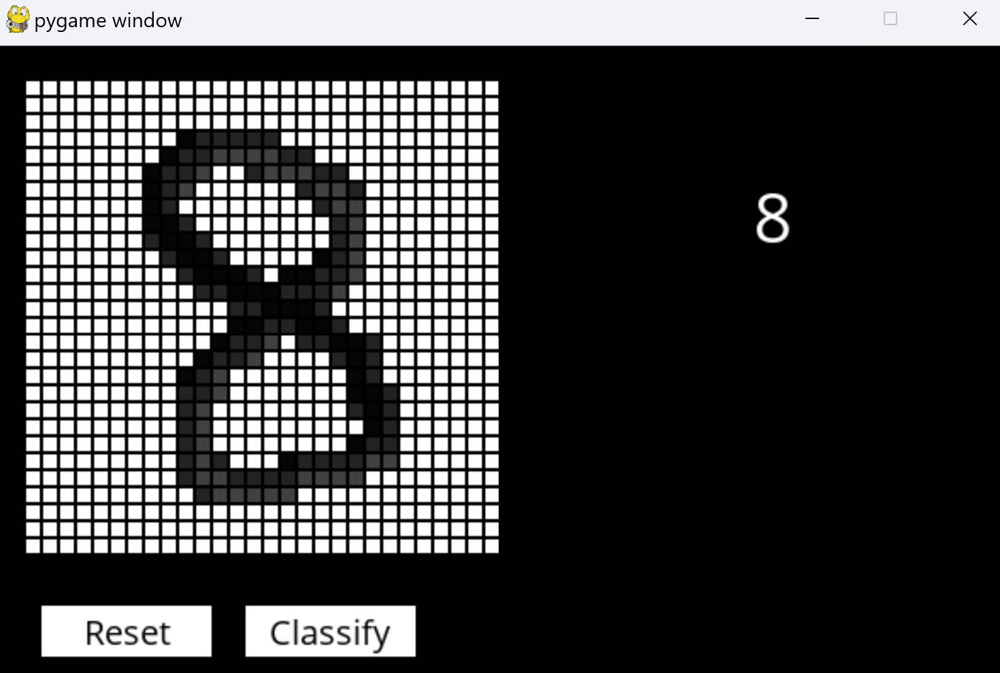

# Digit-Recognition-System

## Description
This project was inspired by a Nintendo DS game called Brain Age that I used to play as a child. In this game, one of the particular minigames is a timed challenge where you write out answers to 20 randomized arithmetic questions onto the DS console's touchscreen in sequence. To mimic the digit recognition system in the DS console, I decided to create a convolutional neural network using max pooling that would be trained with the MNIST dataset. To test the digit recognition system, I developed a Pygame module that would allow a user to write a digit for the system to recognize the digit.

## References
- https://en.wikipedia.org/wiki/Brain_Age:_Train_Your_Brain_in_Minutes_a_Day!
- https://en.wikipedia.org/wiki/MNIST_database
- https://www.analyticsvidhya.com/blog/2021/11/newbies-deep-learning-project-to-recognize-handwritten-digit/